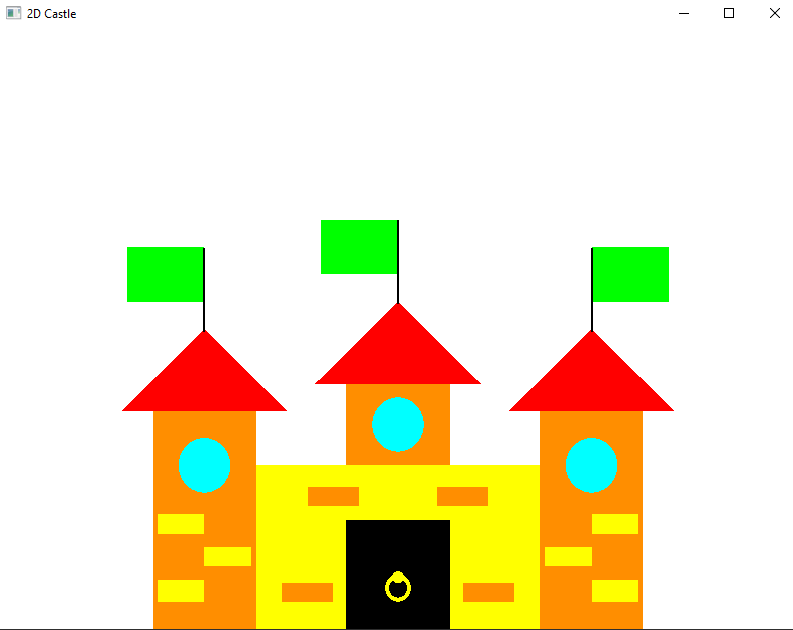

# 2D Castle
Este repositório contém um projeto de exemplo em OpenGL para desenhar um castelo em 2D.

## Captura de tela

  

## Contribuição

Sinta-se à vontade para abrir issues ou enviar pull requests. Toda contribuição é bem-vinda!

## Licença

Este projeto está licenciado sob a Licença MIT - veja o arquivo [LICENSE](LICENSE) para mais detalhes.
